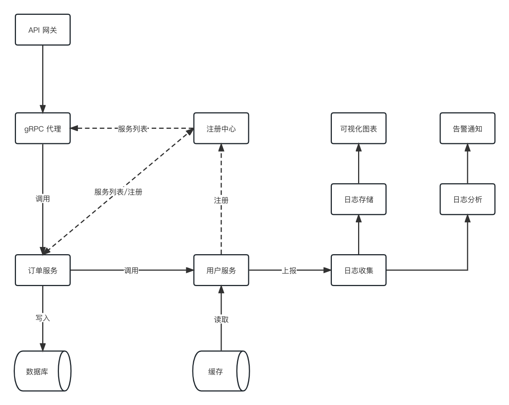

## gRPC System Design

**基建设施**

- gRPC 透明代理解决方案: https://github.com/ZuoFuhong/grpc-cgi-proxy
- gRPC 命名解析和负载均衡的扩展: https://github.com/ZuoFuhong/grpc-naming-monica
- gRPC 拦截器统一管理: https://github.com/ZuoFuhong/grpc-middleware
- gRPC 服务观测数据接收服务: https://github.com/ZuoFuhong/grpc-datacollector
- gRPC 标准服务模板: https://github.com/ZuoFuhong/go_wallet_manage_svr
- gRPC 统一 PB 仓库: https://github.com/ZuoFuhong/grpc-standard-pb
- Monica 服务注册中心: https://github.com/ZuoFuhong/monica

### 文档

B站：https://www.bilibili.com/video/BV1eW4y1N7wj

### License

This project is licensed under the [Apache 2.0 license](https://github.com/ZuoFuhong/grpc-system-design/blob/master/LICENSE).
